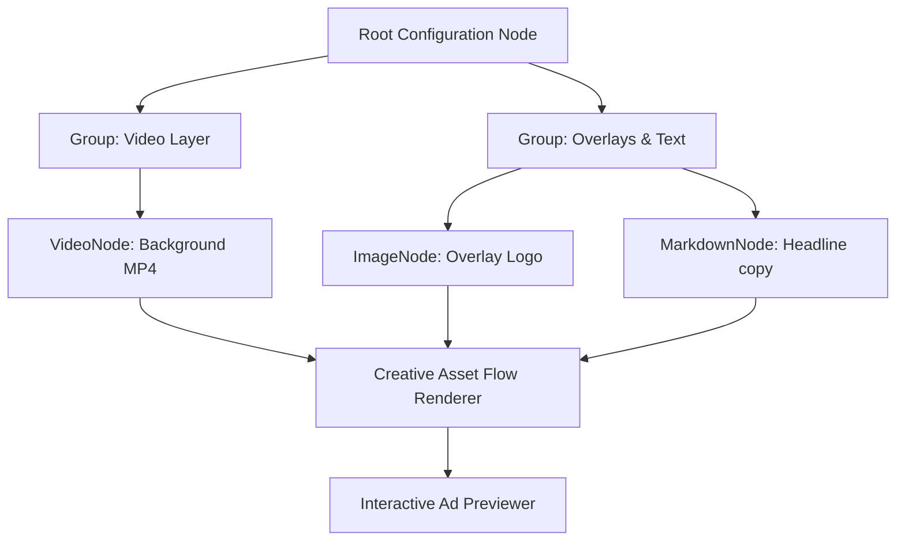

# Creative Asset Flow 🌿

An interactive graph visualization and dependency mapping dashboard designed to map dynamic ad variables, video components, and rendering dependencies. This tool helps designers and developers visualize and edit complex layout hierarchies, asset overrides, and programmatic ad templates in a rich visual canvas.

## 🚀 Key Features

- **Custom Creative Nodes:** Includes pre-configured custom node types specifically modeled for advertising and design templates:
  - `VideoNode`: Tracks video lengths, source files, and resolution metrics.
  - `ImageNode`: Displays thumbnail previews, dimensions, and aspect ratio ratios.
  - `ComponentNode`: Represents interactive editor widgets or UI elements.
  - `MarkdownNode`: Integrates rich text formatting and typography styles inside the graph.
  - `GroupNode`: Handles logical folder structure clustering of layer assets.
- **Interactive Playgrounds:** Connects variables and nodes to map complex ad generation pathways.
- **Dynamic Ad Player Integration:** Integrates mock-up structures of the `@btg-pencil-ai/editor` to showcase realistic ad creative previews directly adjacent to the node connections.
- **Modern UI Shell:** Features a clean, terminal-inspired dark UI with custom control bars, panning, zooming, and automated node alignment.

## 🛠️ System Overview



## 📦 Tech Stack

- **Graph Engine:** `reactflow` (React Flow v11)
- **Framework:** React 18, TypeScript, Vite
- **Markdown Engine:** `react-markdown`, `remark-gfm`
- **Styling:** Tailwind CSS, PostCSS, Autoprefixer
- **Integrations:** `@btg-pencil-ai/editor` mock modules

## ⚙️ Setup & Installation

Ensure you have Node.js (v20+) installed.

```bash
# Clone and enter directory
git clone https://github.com/KhoaTheBest/creative-asset-flow.git
cd creative-asset-flow

# Install dependencies
yarn install

# Run Vite dev server
yarn dev
```

## 💡 Engineering Highlights & Optimizations

- **Tailored Node Ecosystem:** Designed custom nodes from scratch using React Flow’s handle system, enabling unidirectional data flow from parent config nodes into rendering pipelines.
- **Performance Tuning:** Utilized React.memo on complex visual nodes containing live video previews and images, maintaining a responsive rendering performance at 60 FPS under extensive node counts.
